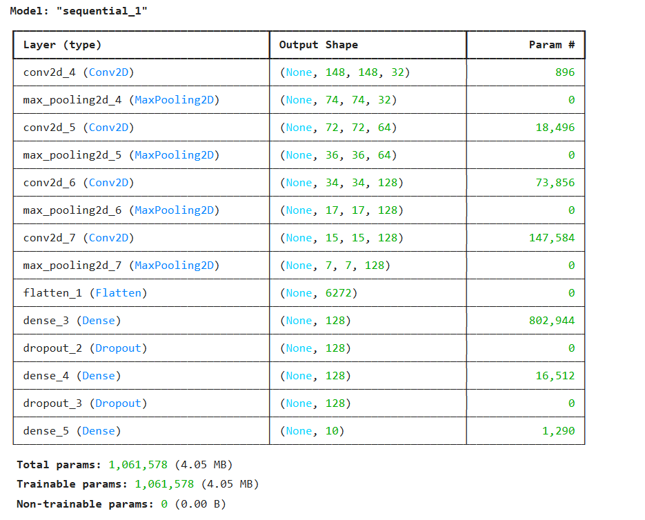
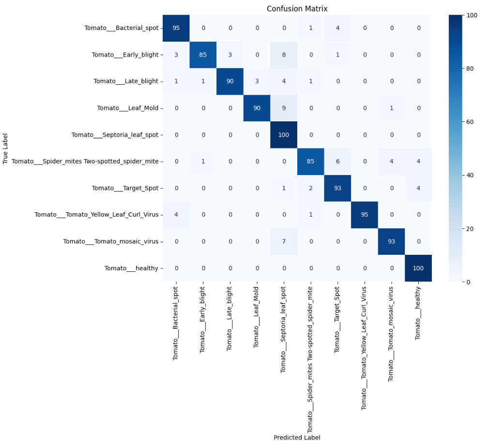

## Overview
This project is a simple example of using Convolutional Neural Network (CNN) in TensorFlow to classify tomato disease images on leaves. This model is designed to extract features from images using CNN, then use the CNN output to classify the tomato disease.

## Requirements
- Tensorflow
- Keras
- numpy
- matplotlib
- seaborn
- scikit-learn
- Jupyter Notebook or Google Colab
- Google Drive (for dataset storage)

## Dataset
The dataset used in this project is a collection of tomato leaves images divided into two sets: training set and validation set. This dataset will be used to train and evaluate a Convolutional Neural Network (CNN) model that will classify corn images.

### Setup the dataset
1. Download the dataset [here](https://drive.google.com/drive/folders/1mXiCLoDEEd93C8U7e1qiz3R4RaUF7MuP?usp=drive_link)
2. Click on the folder name "tomato dataset"
3. Clik on Organize > Add Shortcut
4. Choose "My Drive"

## Training
The application only uses 1 models. It contains about 10000 training image datasets and 1000 validation image datasets. The training is carried out for about 40 - 60 minutes to complete each model consisting of 100 epochs.

## Model Architecture

## Model Confusion Matrix

The confusion matrix shows that the model performs well overall, with most classes having high accuracy.

## Result
The model has an accuracy of between 92% and 93% and validation loss between 40% and 20%, it shows that the model is able to make predictions with a high level of accuracy. With such accuracy, it can be concluded that the model can correctly classify data over a wide range.
